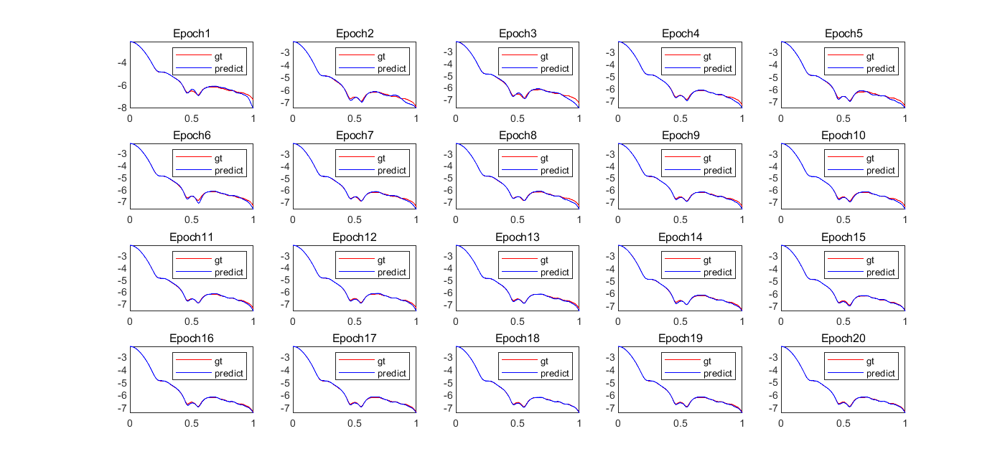
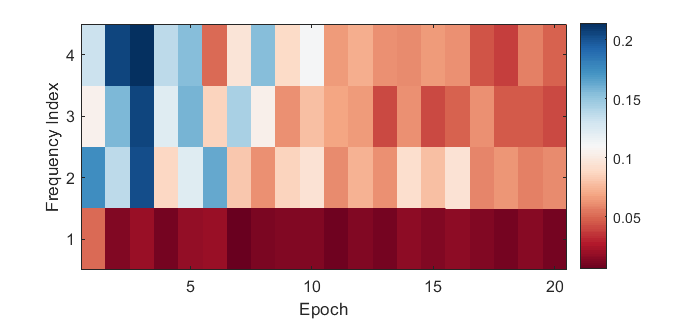

# F_principle_mnist
Unofficial demo example of the frequency principle for the mnist dataset. As shown in the figure, as training proceeds, the low-frequency components fit first, and then the high-frequency components converge.

